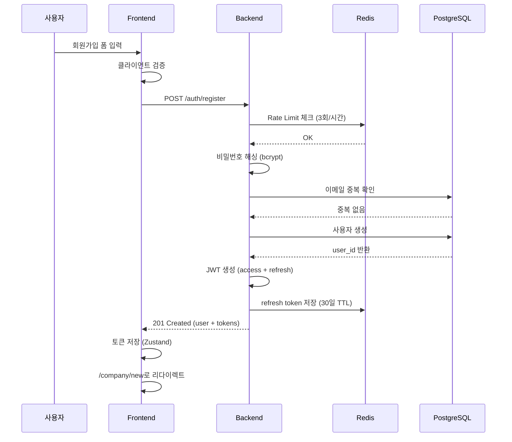
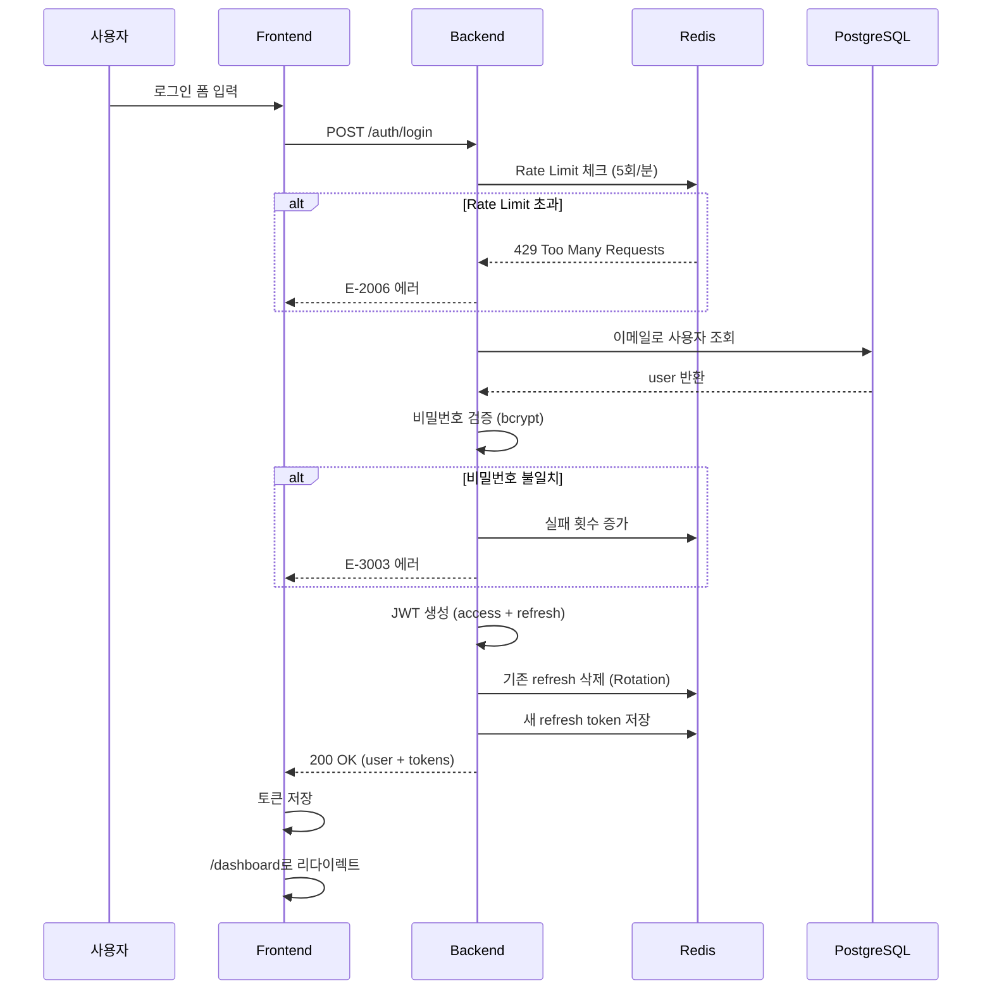
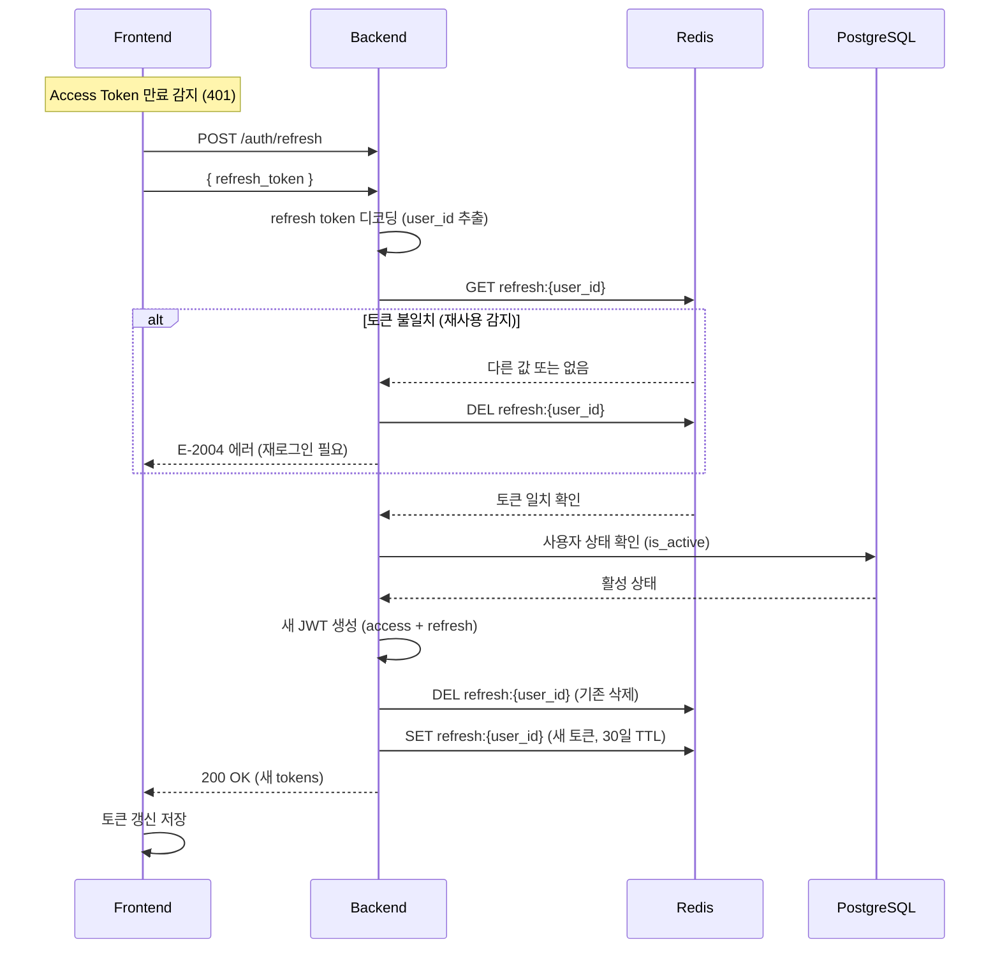
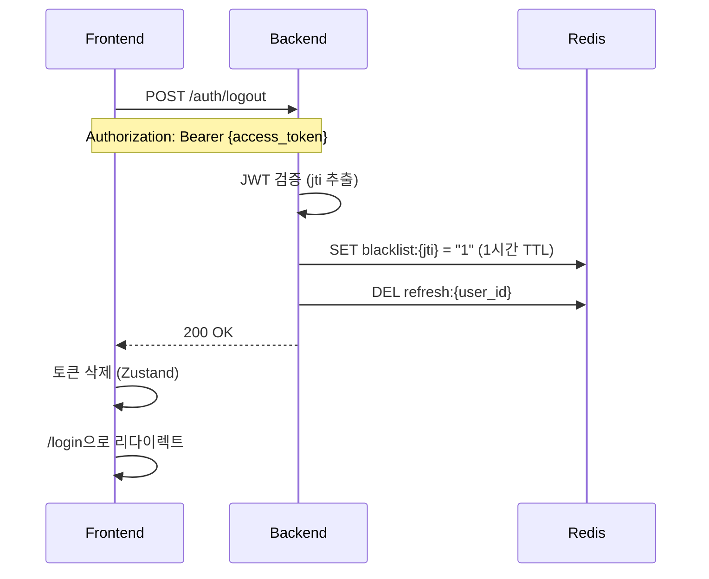

# F-01 사용자 인증 및 계정 관리 — 기술 설계서

## 1. 참조
- 인수조건: docs/project/features.md #F-01
- 시스템 설계: docs/system/system-design.md
- ERD: docs/system/erd.md
- API 컨벤션: docs/system/api-conventions.md
- 디자인 시스템: docs/system/design-system.md
- 네비게이션: docs/system/navigation.md

---

## 2. 아키텍처 결정

### 결정 1: JWT 기반 Stateless 인증
- **선택지**: A) 세션 기반 인증 / B) JWT 기반 인증
- **결정**: B) JWT 기반 인증
- **근거**:
  - 수평 확장 용이 (서버 간 세션 공유 불필요)
  - 마이크로서비스 전환 시 호환성 우수
  - 모바일 앱 확장 고려 시 적합

### 결정 2: Refresh Token Rotation (RTR) 적용
- **선택지**: A) 고정 Refresh Token / B) Refresh Token Rotation
- **결정**: B) Refresh Token Rotation
- **근거**:
  - 토큰 탈취 시 피해 최소화
  - OAuth 2.0 보안 모범 사례 준수
  - Redis로 기존 토큰 무효화 용이

### 결정 3: Rate Limiting 저장소
- **선택지**: A) 메모리 기반 / B) Redis 기반
- **결정**: B) Redis 기반
- **근거**:
  - 분산 환경에서 일관된 제한 가능
  - TTL 자동 만료로 관리 편의성
  - 향후 다중 인스턴스 확장 대비

---

## 3. API 설계

### 3.1 POST /api/v1/auth/register
- **목적**: 이메일/비밀번호 회원가입
- **인증**: 불필요
- **Rate Limit**: 3회/시간 (IP 기준)

**Request Body**:
```json
{
  "email": "user@example.com",
  "password": "SecureP@ss123",
  "name": "홍길동",
  "phone": "010-1234-5678"
}
```

**Response (201 Created)**:
```json
{
  "success": true,
  "data": {
    "user": {
      "id": "550e8400-e29b-41d4-a716-446655440000",
      "email": "user@example.com",
      "name": "홍길동",
      "phone": "010-1234-5678",
      "role": "owner",
      "plan": "free",
      "is_active": true,
      "created_at": "2026-03-01T10:00:00Z"
    },
    "access_token": "eyJhbGciOiJIUzI1NiIsInR5cCI6IkpXVCJ9...",
    "refresh_token": "rt_660e8400e29b41d4a716...",
    "token_type": "bearer",
    "expires_in": 3600
  },
  "message": "회원가입이 완료되었습니다."
}
```

**에러 케이스**:
| 코드 | HTTP | 상황 |
|------|------|------|
| E-1001 | 400 | 입력값 검증 실패 (이메일 형식, 비밀번호 규칙 등) |
| E-3001 | 409 | 이미 등록된 이메일 |
| E-2006 | 429 | 요청 횟수 초과 (3회/시간) |

---

### 3.2 POST /api/v1/auth/login
- **목적**: 이메일/비밀번호 로그인
- **인증**: 불필요
- **Rate Limit**: 5회/분 (IP 기준)

**Request Body**:
```json
{
  "email": "user@example.com",
  "password": "SecureP@ss123"
}
```

**Response (200 OK)**:
```json
{
  "success": true,
  "data": {
    "user": {
      "id": "550e8400-e29b-41d4-a716-446655440000",
      "email": "user@example.com",
      "name": "홍길동",
      "role": "owner",
      "plan": "standard",
      "plan_expires_at": "2026-04-01T00:00:00Z",
      "company_id": "660e8400-e29b-41d4-a716-446655440001"
    },
    "access_token": "eyJhbGciOiJIUzI1NiIsInR5cCI6IkpXVCJ9...",
    "refresh_token": "rt_770e8400e29b41d4a716...",
    "token_type": "bearer",
    "expires_in": 3600
  },
  "message": "로그인되었습니다."
}
```

**에러 케이스**:
| 코드 | HTTP | 상황 |
|------|------|------|
| E-1001 | 400 | 입력값 검증 실패 |
| E-3002 | 404 | 사용자를 찾을 수 없음 |
| E-3003 | 401 | 비밀번호 불일치 |
| E-3004 | 401 | 비활성화된 계정 |
| E-2006 | 429 | 요청 횟수 초과 (5회/분) |

---

### 3.3 POST /api/v1/auth/refresh
- **목적**: 액세스 토큰 갱신 (Refresh Token Rotation)
- **인증**: 불필요 (Refresh Token으로 인증)
- **Rate Limit**: 30회/시간 (User ID 기준)

**Request Body**:
```json
{
  "refresh_token": "rt_770e8400e29b41d4a716..."
}
```

**Response (200 OK)**:
```json
{
  "success": true,
  "data": {
    "access_token": "eyJhbGciOiJIUzI1NiIsInR5cCI6IkpXVCJ9...",
    "refresh_token": "rt_880e8400e29b41d4a716...",
    "token_type": "bearer",
    "expires_in": 3600
  }
}
```

**에러 케이스**:
| 코드 | HTTP | 상황 |
|------|------|------|
| E-2004 | 401 | 유효하지 않은 리프레시 토큰 (재사용 감지 포함) |
| E-2002 | 401 | 리프레시 토큰 만료 |

---

### 3.4 POST /api/v1/auth/logout
- **목적**: 로그아웃 (토큰 무효화)
- **인증**: 필요

**Request Body**: 없음

**Response (200 OK)**:
```json
{
  "success": true,
  "data": null,
  "message": "로그아웃되었습니다."
}
```

---

### 3.5 GET /api/v1/auth/kakao
- **목적**: 카카오 OAuth 로그인 시작
- **인증**: 불필요
- **동작**: 카카오 인증 페이지로 리다이렉트

**Query Parameters**:
| 파라미터 | 타입 | 설명 |
|----------|------|------|
| `redirect_uri` | string | 콜백 URL (선택, 기본값: /callback/kakao) |

**Response**: 302 Redirect to Kakao Auth

---

### 3.6 GET /api/v1/auth/kakao/callback
- **목적**: 카카오 OAuth 콜백 처리
- **인증**: 불필요

**Query Parameters**:
| 파라미터 | 타입 | 설명 |
|----------|------|------|
| `code` | string | 카카오 인증 코드 |
| `state` | string | CSRF 방지용 상태 값 |

**Response (302 Redirect)**:
- 성공: `/dashboard` (토큰은 쿠키 또는 프래그먼트로 전달)
- 실패: `/login?error={error_code}`

**에러 케이스**:
| 코드 | HTTP | 상황 |
|------|------|------|
| E-8001 | 502 | 카카오 API 호출 실패 |
| E-2001 | 401 | state 불일치 (CSRF 의심) |

---

### 3.7 POST /api/v1/auth/password/reset
- **목적**: 비밀번호 재설정 이메일 발송
- **인증**: 불필요
- **Rate Limit**: 3회/시간 (IP 기준)

**Request Body**:
```json
{
  "email": "user@example.com"
}
```

**Response (200 OK)**:
```json
{
  "success": true,
  "data": null,
  "message": "비밀번호 재설정 링크를 이메일로 발송했습니다."
}
```

---

### 3.8 POST /api/v1/auth/password/confirm
- **목적**: 비밀번호 재설정 확인
- **인증**: 불필요 (토큰으로 인증)

**Request Body**:
```json
{
  "token": "reset_token_here",
  "new_password": "NewSecureP@ss456"
}
```

**Response (200 OK)**:
```json
{
  "success": true,
  "data": null,
  "message": "비밀번호가 변경되었습니다."
}
```

---

### 3.9 GET /api/v1/users/me
- **목적**: 내 정보 조회
- **인증**: 필요

**Response (200 OK)**:
```json
{
  "success": true,
  "data": {
    "id": "550e8400-e29b-41d4-a716-446655440000",
    "email": "user@example.com",
    "name": "홍길동",
    "phone": "010-1234-5678",
    "role": "owner",
    "plan": "standard",
    "plan_expires_at": "2026-04-01T00:00:00Z",
    "company_id": "660e8400-e29b-41d4-a716-446655440001",
    "is_active": true,
    "created_at": "2026-01-15T09:30:00Z",
    "updated_at": "2026-03-01T10:00:00Z"
  }
}
```

---

### 3.10 PUT /api/v1/users/me
- **목적**: 내 정보 수정
- **인증**: 필요

**Request Body**:
```json
{
  "name": "홍길동",
  "phone": "010-9876-5432"
}
```

**Response (200 OK)**:
```json
{
  "success": true,
  "data": {
    "id": "550e8400-e29b-41d4-a716-446655440000",
    "email": "user@example.com",
    "name": "홍길동",
    "phone": "010-9876-5432",
    "updated_at": "2026-03-01T11:00:00Z"
  },
  "message": "정보가 수정되었습니다."
}
```

---

### 3.11 DELETE /api/v1/users/me
- **목적**: 계정 탈퇴 (Soft Delete)
- **인증**: 필요

**Request Body**:
```json
{
  "password": "SecureP@ss123",
  "reason": "서비스 불만족"
}
```

**Response (200 OK)**:
```json
{
  "success": true,
  "data": null,
  "message": "계정이 탈퇴 처리되었습니다. 30일 이내에 복구 가능합니다."
}
```

---

## 4. DB 설계

### 4.1 users 테이블 (ERD에서 정의된 내용 기반)

| 컬럼 | 타입 | 제약조건 | 설명 |
|------|------|----------|------|
| id | UUID | PK | 사용자 고유 식별자 |
| email | VARCHAR(255) | UK, NOT NULL | 이메일 (로그인 ID) |
| hashed_password | VARCHAR(255) | | 비밀번호 해시 (OAuth 시 NULL) |
| name | VARCHAR(100) | NOT NULL | 사용자명 |
| phone | VARCHAR(20) | | 전화번호 |
| kakao_id | VARCHAR(100) | UK | 카카오 사용자 ID |
| role | VARCHAR(20) | NOT NULL, DEFAULT 'owner' | 역할 (owner/manager/employee/admin) |
| plan | VARCHAR(20) | NOT NULL, DEFAULT 'free' | 플랜 (free/basic/standard/premium/enterprise) |
| plan_expires_at | TIMESTAMPTZ | | 플랜 만료일시 |
| is_active | BOOLEAN | NOT NULL, DEFAULT TRUE | 활성 여부 |
| created_at | TIMESTAMPTZ | NOT NULL | 생성일시 |
| updated_at | TIMESTAMPTZ | NOT NULL | 수정일시 |

**인덱스**:
```sql
CREATE INDEX idx_users_email ON users(email);
CREATE INDEX idx_users_kakao_id ON users(kakao_id) WHERE kakao_id IS NOT NULL;
CREATE INDEX idx_users_is_active ON users(is_active);
```

### 4.2 Redis 스키마

| Key 패턴 | 타입 | TTL | 설명 |
|----------|------|-----|------|
| `refresh:{user_id}` | String | 30일 | 리프레시 토큰 저장 |
| `blacklist:{token_jti}` | String | 1시간 | 로그아웃 토큰 블랙리스트 |
| `ratelimit:login:{ip}` | String | 1분 | 로그인 시도 횟수 |
| `ratelimit:register:{ip}` | String | 1시간 | 회원가입 시도 횟수 |
| `reset_token:{token}` | String | 1시간 | 비밀번호 재설정 토큰 |

---

## 5. 시퀀스 흐름

### 5.1 회원가입 시퀀스



### 5.2 로그인 시퀀스



### 5.3 토큰 갱신 시퀀스 (Refresh Token Rotation)



### 5.4 카카오 OAuth 시퀀스

```mermaid
sequenceDiagram
    participant U as 사용자
    participant F as Frontend
    participant B as Backend
    participant K as 카카오 API
    participant D as PostgreSQL
    participant R as Redis

    U->>F: 카카오 로그인 클릭
    F->>B: GET /auth/kakao
    B->>B: state 생성 (CSRF 방지)
    B->>R: state 저장 (10분 TTL)
    B-->>F: 302 Redirect (카카오 인증 URL + state)

    F->>K: 카카오 인증 페이지 요청
    U->>K: 카카오 로그인/동의
    K-->>F: 302 Redirect /auth/kakao/callback?code=xxx&state=yyy

    F->>B: GET /auth/kakao/callback?code&state
    B->>R: state 검증
    R-->>B: state 일치

    B->>K: POST /oauth/token (code → access_token)
    K-->>B: 카카오 access_token

    B->>K: GET /v2/user/me (사용자 정보)
    K-->>B: kakao_id, profile

    B->>D: kakao_id로 사용자 조회

    alt 기존 회원
        D-->>B: user 반환
    else 신규 회원
        B->>D: 사용자 생성 (kakao_id, email, name)
        D-->>B: user 반환
    end

    B->>B: JWT 생성
    B->>R: refresh token 저장

    B-->>F: 302 Redirect /dashboard (토큰 쿠키 설정)
```



### 5.5 로그아웃 시퀀스



---

## 6. 보안 설계

### 6.1 비밀번호 정책
- **최소 길이**: 8자
- **복잡성**: 영문 대소문자, 숫자, 특수문자 중 3가지 이상 조합
- **해싱**: bcrypt (rounds=12)
- **검증**: python-bcrypt 라이브러리 사용

```python
# 비밀번호 해싱
import bcrypt

def hash_password(password: str) -> str:
    salt = bcrypt.gensalt(rounds=12)
    return bcrypt.hashpw(password.encode('utf-8'), salt).decode('utf-8')

def verify_password(plain_password: str, hashed_password: str) -> bool:
    return bcrypt.checkpw(
        plain_password.encode('utf-8'),
        hashed_password.encode('utf-8')
    )
```

### 6.2 JWT 구성

**Access Token Payload**:
```json
{
  "sub": "550e8400-e29b-41d4-a716-446655440000",
  "company_id": "660e8400-e29b-41d4-a716-446655440001",
  "plan": "standard",
  "role": "owner",
  "exp": 1700000000,
  "iat": 1699996400,
  "jti": "550e8400-e29b-41d4-a716-446655440002"
}
```

**토큰 설정**:
| 항목 | Access Token | Refresh Token |
|------|--------------|---------------|
| 유효기간 | 1시간 | 30일 |
| 저장 위치 | Frontend (Zustand) | Redis + Frontend |
| 알고리즘 | HS256 | HS256 |
| 비밀키 | JWT_SECRET_KEY | JWT_SECRET_KEY |

### 6.3 Rate Limiting 구현

```python
# core/rate_limit.py
from fastapi import HTTPException
from redis import Redis

async def check_rate_limit(
    redis: Redis,
    key: str,
    limit: int,
    window_seconds: int
) -> None:
    current = await redis.incr(key)
    if current == 1:
        await redis.expire(key, window_seconds)

    if current > limit:
        ttl = await redis.ttl(key)
        raise HTTPException(
            status_code=429,
            detail={
                "code": "E-2006",
                "message": f"요청 횟수를 초과했습니다. {ttl}초 후 다시 시도해주세요.",
                "details": {
                    "retry_after": ttl,
                    "limit": limit
                }
            }
        )
```

### 6.4 OAuth CSRF 방지

```python
# 카카오 OAuth state 생성 및 검증
import secrets

async def create_oauth_state(redis: Redis, user_ip: str) -> str:
    state = secrets.token_urlsafe(32)
    key = f"oauth_state:{state}"
    await redis.setex(key, 600, user_ip)  # 10분 유효
    return state

async def verify_oauth_state(redis: Redis, state: str, user_ip: str) -> bool:
    key = f"oauth_state:{state}"
    stored_ip = await redis.get(key)
    if stored_ip and stored_ip.decode() == user_ip:
        await redis.delete(key)
        return True
    return False
```

---

## 7. 영향 범위

### 7.1 수정 필요 파일
| 파일 | 변경 내용 |
|------|-----------|
| `backend/app/core/config.py` | JWT, 카카오 OAuth 환경변수 추가 |
| `backend/app/core/security.py` | JWT 생성/검증, 비밀번호 해싱 함수 |
| `backend/app/core/dependencies.py` | 인증 의존성 (get_current_user) |
| `backend/app/db/models/user.py` | User 모델 정의 |
| `backend/app/api/deps.py` | 인증 미들웨어 |
| `backend/app/schemas/auth.py` | 요청/응답 스키마 |
| `backend/app/schemas/user.py` | 사용자 스키마 |
| `backend/app/services/auth_service.py` | 인증 비즈니스 로직 |
| `backend/app/services/user_service.py` | 사용자 CRUD |
| `frontend/lib/stores/auth-store.ts` | 인증 상태 관리 |
| `frontend/lib/api/client.ts` | 토큰 인터셉터 |
| `frontend/lib/api/auth.ts` | 인증 API 클라이언트 |
| `frontend/middleware.ts` | 인증 가드 |

### 7.2 신규 생성 파일
| 파일 | 설명 |
|------|------|
| `backend/app/api/v1/auth.py` | 인증 API 라우터 |
| `backend/app/api/v1/users.py` | 사용자 API 라우터 |
| `backend/app/core/rate_limit.py` | Rate Limiting 유틸리티 |
| `backend/app/core/exceptions.py` | 커스텀 예외 클래스 |
| `frontend/app/(auth)/login/page.tsx` | 로그인 페이지 |
| `frontend/app/(auth)/register/page.tsx` | 회원가입 페이지 |
| `frontend/app/(auth)/forgot-password/page.tsx` | 비밀번호 찾기 페이지 |
| `frontend/app/(auth)/callback/kakao/page.tsx` | 카카오 콜백 페이지 |
| `frontend/components/auth/login-form.tsx` | 로그인 폼 컴포넌트 |
| `frontend/components/auth/register-form.tsx` | 회원가입 폼 컴포넌트 |
| `frontend/components/auth/social-login-button.tsx` | 소셜 로그인 버튼 |

---

## 8. 성능 설계

### 8.1 인덱스 계획
- `users.email`: UK (이메일 로그인 조회)
- `users.kakao_id`: 인덱스 (OAuth 로그인 조회)
- `users.is_active`: 인덱스 (활성 사용자 필터링)

### 8.2 캐싱 전략
| 대상 | 캐시 방식 | TTL | 설명 |
|------|-----------|-----|------|
| Refresh Token | Redis | 30일 | 사용자별 단일 토큰 |
| 블랙리스트 | Redis | 1시간 | Access Token 만료까지 |
| Rate Limit | Redis | 1분~1시간 | 엔드포인트별 차등 |

### 8.3 응답 최적화
- JWT 검증은 DB 조회 없이 수행 (Stateless)
- 사용자 정보는 Access Token Payload에 포함하여 추가 조회 최소화
- Refresh Token은 Redis에서 O(1) 조회

---

## 9. 환경 변수

```bash
# .env
JWT_SECRET_KEY=your-secret-key-here
JWT_ALGORITHM=HS256
ACCESS_TOKEN_EXPIRE_MINUTES=60
REFRESH_TOKEN_EXPIRE_DAYS=30

KAKAO_CLIENT_ID=your-kakao-client-id
KAKAO_CLIENT_SECRET=your-kakao-client-secret
KAKAO_REDIRECT_URI=http://localhost:3000/callback/kakao

REDIS_URL=redis://localhost:6379/0

# 비밀번호 정책
PASSWORD_MIN_LENGTH=8
BCRYPT_ROUNDS=12
```

---

## 변경 이력

| 날짜 | 버전 | 변경 내용 | 이유 |
|------|------|-----------|------|
| 2026-03-01 | 1.0.0 | 초기 설계서 작성 | F-01 기능 구현 |
