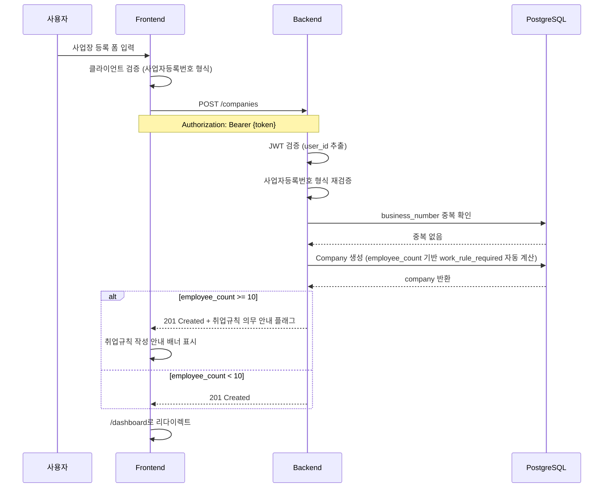
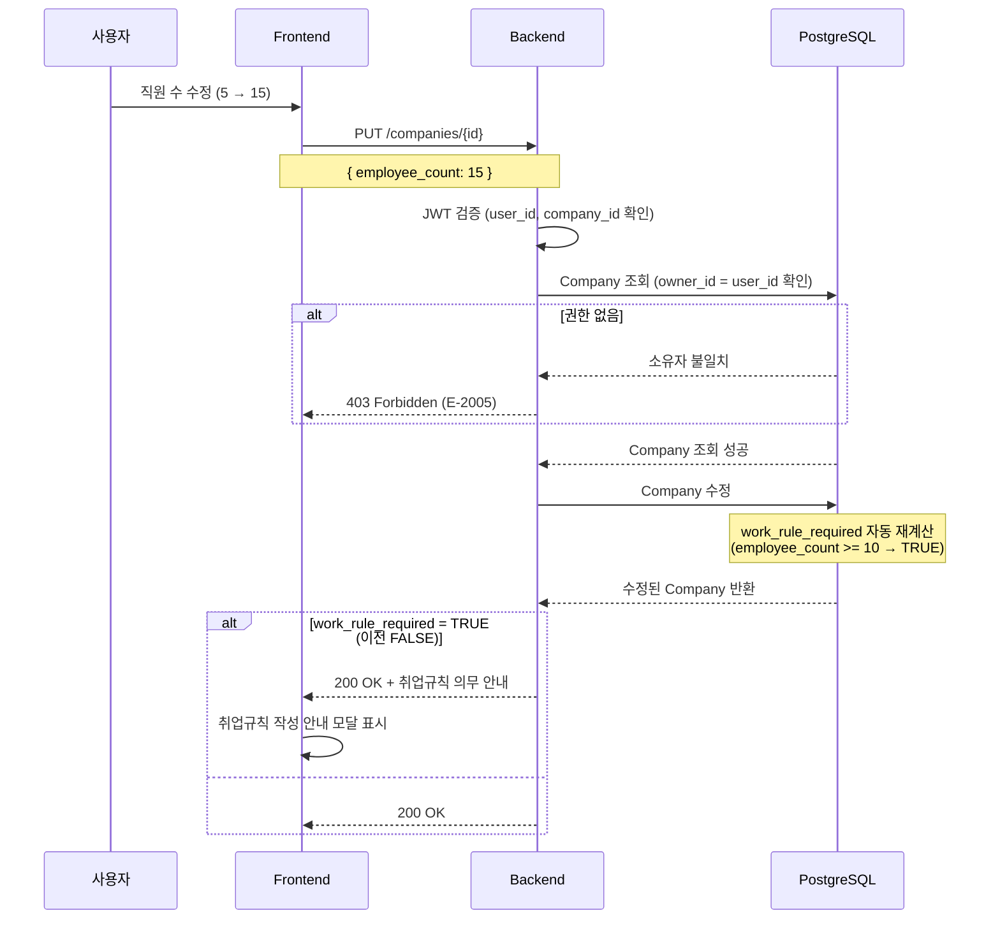
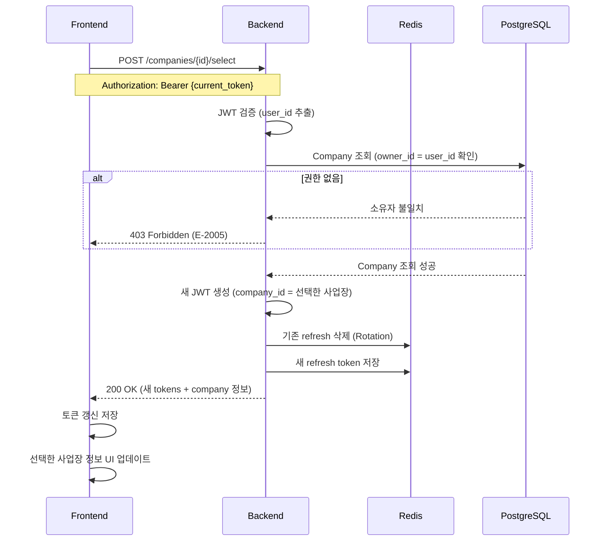
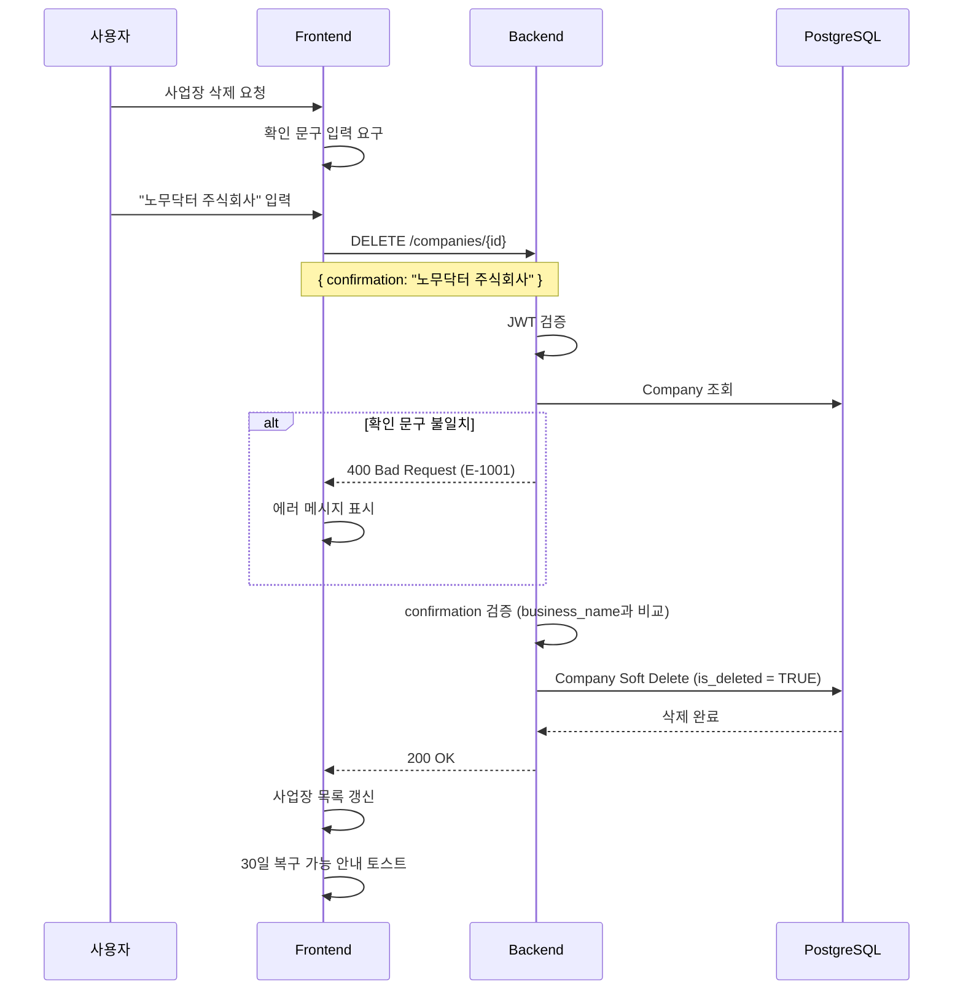

# F-02 사업장 관리 — 기술 설계서

## 1. 참조
- 인수조건: docs/project/features.md #F-02
- 시스템 설계: docs/system/system-design.md
- ERD: docs/system/erd.md (companies 테이블)
- API 컨벤션: docs/system/api-conventions.md
- 디자인 시스템: docs/system/design-system.md
- 네비게이션: docs/system/navigation.md
- 기존 설계: docs/specs/F-01-auth/design.md

---

## 2. 아키텍처 결정

### 결정 1: 사업자등록번호 검증 방식
- **선택지**: A) 프론트엔드에서만 검증 / B) 백엔드에서만 검증 / C) 프론트엔드 + 백엔드 모두 검증
- **결정**: C) 프론트엔드 + 백엔드 모두 검증
- **근거**:
  - UX 향상: 프론트엔드에서 즉시 피드백 제공
  - 보안: 백엔드에서 최종 검증으로 잘못된 데이터 유입 방지
  - 정규식 패턴: `^\d{3}-\d{2}-\d{5}$` (xxx-xx-xxxxx 형식)

### 결정 2: work_rule_required 자동 계산 방식
- **선택지**: A) DB Generated Column / B) Application Layer 계산 / C) Trigger
- **결정**: A) DB Generated Column
- **근거**:
  - 데이터 일관성 보장 (DB 레벨에서 자동 계산)
  - Application Layer 복잡도 감소
  - 직원 수 변경 시 자동 반영
  - PostgreSQL 16의 Generated Column 기능 활용

### 결정 3: 사업장 삭제 방식
- **선택지**: A) Hard Delete / B) Soft Delete (is_deleted 컬럼) / C) Soft Delete (deleted_at 컬럼)
- **결정**: B) Soft Delete (is_deleted 컬럼)
- **근거**:
  - 규제 준수: 노무 관련 데이터는 법적 보관 의무 존재
  - 복구 가능: 실수로 삭제한 경우 복구 지원
  - 감사 추적: 삭제 이력 유지
  - 기존 is_active 패턴과 일관성 (is_deleted로 명확화)

### 결정 4: 사업장 선택 및 컨텍스트 관리
- **선택지**: A) 세션 기반 / B) JWT company_id 포함 / C) 별도 company_context 테이블
- **결정**: B) JWT company_id 포함
- **근거**:
  - Stateless 구조 유지
  - F-01 인증 설계와 일관성
  - API 요청마다 DB 조회 없이 컨텍스트 파악 가능
  - 사업장 전환 시 토큰 재발급으로 처리

---

## 3. API 설계

### 3.1 POST /api/v1/companies
- **목적**: 사업장 등록
- **인증**: 필요 (Bearer Token)
- **Rate Limit**: 10회/시간 (User ID 기준)

**Request Body**:
```json
{
  "business_name": "노무닥터 주식회사",
  "business_number": "123-45-67890",
  "representative_name": "홍길동",
  "industry_type": "it",
  "employee_count": 5,
  "address": "서울특별시 강남구 테헤란로 123",
  "postal_code": "06123",
  "phone": "02-1234-5678"
}
```

**Response (201 Created)**:
```json
{
  "success": true,
  "data": {
    "id": "550e8400-e29b-41d4-a716-446655440000",
    "owner_id": "660e8400-e29b-41d4-a716-446655440001",
    "business_name": "노무닥터 주식회사",
    "business_number": "123-45-67890",
    "representative_name": "홍길동",
    "industry_type": "it",
    "employee_count": 5,
    "address": "서울특별시 강남구 테헤란로 123",
    "postal_code": "06123",
    "phone": "02-1234-5678",
    "work_rule_required": false,
    "created_at": "2026-03-02T10:00:00Z",
    "updated_at": "2026-03-02T10:00:00Z"
  },
  "message": "사업장이 등록되었습니다."
}
```

**에러 케이스**:
| 코드 | HTTP | 상황 |
|------|------|------|
| E-1001 | 400 | 입력값 검증 실패 (사업자등록번호 형식 등) |
| E-1003 | 400 | 필수 필드 누락 |
| E-4002 | 409 | 이미 등록된 사업자등록번호 |
| E-4003 | 422 | 사업자등록번호 형식이 올바르지 않음 |
| E-2001 | 401 | 인증 필요 |
| E-2006 | 429 | 요청 횟수 초과 |

---

### 3.2 GET /api/v1/companies
- **목적**: 내 사업장 목록 조회
- **인증**: 필요
- **Rate Limit**: 100회/분 (User ID 기준)

**Query Parameters**:
| 파라미터 | 타입 | 기본값 | 설명 |
|----------|------|--------|------|
| `limit` | int | 20 | 페이지 크기 (최대 100) |
| `cursor` | string | null | 페이지네이션 커서 |
| `is_deleted` | bool | false | 삭제된 사업장 포함 여부 (관리자용) |

**Response (200 OK)**:
```json
{
  "success": true,
  "data": [
    {
      "id": "550e8400-e29b-41d4-a716-446655440000",
      "business_name": "노무닥터 주식회사",
      "business_number": "123-45-67890",
      "industry_type": "it",
      "employee_count": 5,
      "work_rule_required": false,
      "created_at": "2026-03-02T10:00:00Z"
    }
  ],
  "pagination": {
    "cursor": null,
    "hasNext": false,
    "limit": 20,
    "totalCount": 1
  }
}
```

---

### 3.3 GET /api/v1/companies/{id}
- **목적**: 사업장 상세 조회
- **인증**: 필요

**Path Parameters**:
| 파라미터 | 타입 | 설명 |
|----------|------|------|
| `id` | UUID | 사업장 ID |

**Response (200 OK)**:
```json
{
  "success": true,
  "data": {
    "id": "550e8400-e29b-41d4-a716-446655440000",
    "owner_id": "660e8400-e29b-41d4-a716-446655440001",
    "business_name": "노무닥터 주식회사",
    "business_number": "123-45-67890",
    "representative_name": "홍길동",
    "industry_type": "it",
    "employee_count": 5,
    "address": "서울특별시 강남구 테헤란로 123",
    "postal_code": "06123",
    "phone": "02-1234-5678",
    "work_rule_required": false,
    "created_at": "2026-03-02T10:00:00Z",
    "updated_at": "2026-03-02T10:00:00Z"
  }
}
```

**에러 케이스**:
| 코드 | HTTP | 상황 |
|------|------|------|
| E-4001 | 404 | 사업장을 찾을 수 없음 |
| E-2005 | 403 | 다른 사용자의 사업장 접근 |

---

### 3.4 PUT /api/v1/companies/{id}
- **목적**: 사업장 정보 수정
- **인증**: 필요 (소유자만)

**Request Body**:
```json
{
  "business_name": "노무닥터 주식회사",
  "representative_name": "홍길동",
  "industry_type": "it",
  "employee_count": 15,
  "address": "서울특별시 강남구 테헤란로 456",
  "postal_code": "06123",
  "phone": "02-9876-5432"
}
```

**Response (200 OK)**:
```json
{
  "success": true,
  "data": {
    "id": "550e8400-e29b-41d4-a716-446655440000",
    "business_name": "노무닥터 주식회사",
    "employee_count": 15,
    "work_rule_required": true,
    "updated_at": "2026-03-02T11:00:00Z"
  },
  "message": "사업장 정보가 수정되었습니다."
}
```

**비고**:
- `business_number`는 수정 불가 (식별자 역할)
- `employee_count` 변경 시 `work_rule_required` 자동 재계산

**에러 케이스**:
| 코드 | HTTP | 상황 |
|------|------|------|
| E-4001 | 404 | 사업장을 찾을 수 없음 |
| E-2005 | 403 | 수정 권한 없음 |
| E-1001 | 400 | 입력값 검증 실패 |

---

### 3.5 DELETE /api/v1/companies/{id}
- **목적**: 사업장 삭제 (Soft Delete)
- **인증**: 필요 (소유자만)

**Request Body**:
```json
{
  "confirmation": "노무닥터 주식회사"
}
```

**Response (200 OK)**:
```json
{
  "success": true,
  "data": null,
  "message": "사업장이 삭제되었습니다. 30일 이내에 복구 가능합니다."
}
```

**에러 케이스**:
| 코드 | HTTP | 상황 |
|------|------|------|
| E-4001 | 404 | 사업장을 찾을 수 없음 |
| E-2005 | 403 | 삭제 권한 없음 |
| E-1001 | 400 | 확인 문구 불일치 |

---

### 3.6 POST /api/v1/companies/{id}/select
- **목적**: 현재 사업장 선택 (컨텍스트 변경)
- **인증**: 필요

**Response (200 OK)**:
```json
{
  "success": true,
  "data": {
    "access_token": "eyJhbGciOiJIUzI1NiIsInR5cCI6IkpXVCJ9...",
    "refresh_token": "rt_880e8400e29b41d4...",
    "token_type": "bearer",
    "expires_in": 3600,
    "company": {
      "id": "550e8400-e29b-41d4-a716-446655440000",
      "business_name": "노무닥터 주식회사"
    }
  },
  "message": "선택한 사업장으로 전환되었습니다."
}
```

**에러 케이스**:
| 코드 | HTTP | 상황 |
|------|------|------|
| E-4001 | 404 | 사업장을 찾을 수 없음 |
| E-2005 | 403 | 해당 사업장 접근 권한 없음 |

---

## 4. DB 설계

### 4.1 companies 테이블 (ERD 기반, 변경 사항 반영)

| 컬럼 | 타입 | 제약조건 | 설명 |
|------|------|----------|------|
| id | UUID | PK | 사업장 고유 식별자 |
| owner_id | UUID | FK(users.id), NOT NULL | 소유자 ID |
| business_name | VARCHAR(200) | NOT NULL | 사업장명 |
| business_number | VARCHAR(20) | UK, NOT NULL | 사업자등록번호 (xxx-xx-xxxxx) |
| representative_name | VARCHAR(100) | NOT NULL | 대표자명 |
| industry_type | VARCHAR(50) | NOT NULL, CHECK | 업종 |
| employee_count | INTEGER | NOT NULL, DEFAULT 0 | 직원 수 |
| address | TEXT | NULL | 주소 |
| postal_code | VARCHAR(10) | NULL | 우편번호 |
| phone | VARCHAR(20) | NULL | 대표 전화번호 |
| work_rule_required | BOOLEAN | GENERATED ALWAYS AS (employee_count >= 10) STORED | 취업규칙 의무 여부 |
| is_deleted | BOOLEAN | NOT NULL, DEFAULT FALSE | 삭제 여부 (Soft Delete) |
| created_at | TIMESTAMPTZ | NOT NULL | 생성일시 |
| updated_at | TIMESTAMPTZ | NOT NULL | 수정일시 |

**Generated Column 정의**:
```sql
work_rule_required BOOLEAN GENERATED ALWAYS AS (
    employee_count >= 10
) STORED
```

**인덱스**:
```sql
CREATE INDEX idx_companies_owner_id ON companies(owner_id) WHERE is_deleted = FALSE;
CREATE UNIQUE INDEX idx_companies_business_number ON companies(business_number) WHERE is_deleted = FALSE;
CREATE INDEX idx_companies_is_deleted ON companies(is_deleted);
```

**Check Constraint**:
```sql
CONSTRAINT ck_company_industry_type CHECK (
    industry_type IN ('manufacturing', 'food_service', 'retail', 'service', 'it', 'construction', 'healthcare', 'other')
)
```

### 4.2 업종 ENUM 정의

| 값 | 한글명 | 설명 |
|----|--------|------|
| `manufacturing` | 제조업 | 제조 관련 사업 |
| `food_service` | 요식업 | 식당, 카페 등 |
| `retail` | 소매업 | 소매 판매업 |
| `service` | 서비스업 | 일반 서비스업 |
| `it` | IT/정보통신 | IT, 소프트웨어 |
| `construction` | 건설업 | 건설, 인테리어 |
| `healthcare` | 의료업 | 병원, 약국 등 |
| `other` | 기타 | 기타 업종 |

---

## 5. 시퀀스 흐름

### 5.1 사업장 등록 시퀀스



### 5.2 사업장 수정 시퀀스 (직원 수 변경)



### 5.3 사업장 선택 (컨텍스트 변경) 시퀀스



### 5.4 사업장 삭제 (Soft Delete) 시퀀스



---

## 6. 보안 설계

### 6.1 사업자등록번호 검증

**프론트엔드 검증 (Zod)**:
```typescript
const businessNumberRegex = /^\d{3}-\d{2}-\d{5}$/;

const companySchema = z.object({
  business_number: z.string()
    .regex(businessNumberRegex, "사업자등록번호 형식이 올바르지 않습니다. (xxx-xx-xxxxx)")
});
```

**백엔드 검증 (Pydantic)**:
```python
from pydantic import Field

class CompanyBase(BaseModel):
    business_number: str = Field(
        ...,
        pattern=r"^\d{3}-\d{2}-\d{5}$",
        description="사업자등록번호 (xxx-xx-xxxxx)"
    )
```

### 6.2 접근 제어 (RLS 대비)

**Row Level Security 정책**:
```sql
-- 사용자는 자신이 소유한 사업장만 조회 가능
CREATE POLICY companies_select_policy ON companies
    FOR SELECT
    USING (owner_id = current_user_id() AND is_deleted = FALSE);

-- 사용자는 자신이 소유한 사업장만 수정 가능
CREATE POLICY companies_update_policy ON companies
    FOR UPDATE
    USING (owner_id = current_user_id());
```

**Application 레벨 권한 확인**:
```python
async def verify_company_ownership(
    company_id: UUID,
    user_id: UUID,
    db: AsyncSession
) -> Company:
    """사업장 소유권 확인"""
    stmt = select(Company).where(
        Company.id == company_id,
        Company.owner_id == user_id,
        Company.is_deleted == False
    )
    result = await db.execute(stmt)
    company = result.scalar_one_or_none()

    if company is None:
        raise NotFoundError("사업장을 찾을 수 없습니다.", code="E-4001")

    return company
```

### 6.3 Rate Limiting

| 엔드포인트 | 제한 | 기준 |
|------------|------|------|
| POST /companies | 10회/시간 | User ID |
| GET /companies | 100회/분 | User ID |
| GET /companies/{id} | 100회/분 | User ID |
| PUT /companies/{id} | 30회/시간 | User ID |
| DELETE /companies/{id} | 5회/시간 | User ID |
| POST /companies/{id}/select | 30회/시간 | User ID |

---

## 7. 영향 범위

### 7.1 수정 필요 파일

| 파일 | 변경 내용 |
|------|-----------|
| `backend/app/db/models/company.py` | is_deleted 컬럼 추가, Generated Column 정의 |
| `backend/app/schemas/company.py` | 응답 스키마에 work_rule_required_notice 추가 |
| `backend/app/api/v1/companies.py` | 전체 API 구현 (TODO → 실제 구현) |
| `backend/app/core/dependencies.py` | get_current_company 의존성 추가 |
| `backend/app/core/exceptions.py` | Company 관련 에러 클래스 추가 |
| `frontend/lib/stores/company-store.ts` | 사업장 상태 관리 스토어 |
| `frontend/lib/api/company.ts` | 사업장 API 클라이언트 |
| `frontend/middleware.ts` | company_id 없으면 /company/new 리다이렉트 |

### 7.2 신규 생성 파일

| 파일 | 설명 |
|------|------|
| `backend/app/services/company_service.py` | 사업장 비즈니스 로직 |
| `backend/app/repositories/company_repo.py` | 사업장 Repository |
| `backend/app/schemas/company.py` | (기존) 확장 |
| `backend/app/api/v1/companies.py` | (기존) 구현 완료 |
| `frontend/app/(main)/company/new/page.tsx` | 사업장 등록 페이지 |
| `frontend/app/(main)/company/[id]/page.tsx` | 사업장 상세 페이지 |
| `frontend/app/(main)/company/[id]/edit/page.tsx` | 사업장 수정 페이지 |
| `frontend/app/(main)/company/select/page.tsx` | 사업장 선택 페이지 |
| `frontend/components/company/company-form.tsx` | 사업장 등록/수정 폼 |
| `frontend/components/company/company-card.tsx` | 사업장 카드 컴포넌트 |
| `frontend/components/company/company-selector.tsx` | 사업장 선택 드롭다운 |
| `frontend/components/company/work-rule-notice.tsx` | 취업규칙 의무 안내 배너 |

---

## 8. 성능 설계

### 8.1 인덱스 계획

```sql
-- 소유자별 조회 최적화 (삭제되지 않은 사업장만)
CREATE INDEX idx_companies_owner_id ON companies(owner_id) WHERE is_deleted = FALSE;

-- 사업자등록번호 중복 검사 최적화 (삭제되지 않은 사업장만)
CREATE UNIQUE INDEX idx_companies_business_number ON companies(business_number) WHERE is_deleted = FALSE;

-- 삭제 여부 필터링
CREATE INDEX idx_companies_is_deleted ON companies(is_deleted);
```

### 8.2 캐싱 전략

| 대상 | 캐시 방식 | TTL | 설명 |
|------|-----------|-----|------|
| 사용자 사업장 목록 | Redis | 5분 | 자주 조회되는 목록 |
| 사업장 상세 | Redis | 10분 | 수정 시 즉시 무효화 |

**Redis 캐시 Key 패턴**:
```
company:{company_id}              # 사업장 상세
companies:user:{user_id}          # 사용자 사업장 목록
```

### 8.3 응답 최적화

- 목록 조회 시 불필요한 필드 제외 (address, postal_code 등은 상세 조회에서만)
- 커서 기반 페이지네이션으로 대량 데이터 처리
- JWT에 company_id 포함하여 DB 조회 최소화

---

## 9. 마이그레이션

### 9.1 신규 마이그레이션

```bash
alembic revision --autogenerate -m "002_add_company_soft_delete"
```

### 9.2 마이그레이션 내용

```python
# alembic/versions/002_add_company_soft_delete.py
def upgrade():
    # is_deleted 컬럼 추가
    op.add_column('companies', sa.Column('is_deleted', sa.Boolean(), nullable=False, server_default='FALSE'))

    # Generated Column 추가 (work_rule_required)
    op.execute("""
        ALTER TABLE companies
        DROP COLUMN IF EXISTS work_rule_required,
        ADD COLUMN work_rule_required BOOLEAN GENERATED ALWAYS AS (employee_count >= 10) STORED
    """)

    # 인덱스 추가 (조건부)
    op.execute("""
        CREATE INDEX IF NOT EXISTS idx_companies_owner_id_active
        ON companies(owner_id) WHERE is_deleted = FALSE
    """)
    op.execute("""
        CREATE UNIQUE INDEX IF NOT EXISTS idx_companies_business_number_active
        ON companies(business_number) WHERE is_deleted = FALSE
    """)

def downgrade():
    op.drop_index('idx_companies_business_number_active')
    op.drop_index('idx_companies_owner_id_active')
    op.drop_column('companies', 'work_rule_required')
    op.drop_column('companies', 'is_deleted')
```

---

## 10. 환경 변수

```bash
# .env (기존 유지, 추가 없음)
# 사업장 관련 별도 환경 변수 없음
```

---

## 변경 이력

| 날짜 | 버전 | 변경 내용 | 이유 |
|------|------|-----------|------|
| 2026-03-02 | 1.0.0 | 초기 설계서 작성 | F-02 기능 구현 |
