# 노무닥터 ERD (Entity Relationship Diagram)

## 1. 개요

본 문서는 노무닥터 서비스의 데이터베이스 엔티티 관계도를 정의합니다.

### 참조 문서
- 시스템 설계: docs/system/system-design.md
- 기능 명세: docs/project/features.md
- PRD: docs/project/prd_nomoodoc_v2.md (Section 4 DB 스키마)

### 데이터베이스 정보
- **DBMS**: PostgreSQL 16
- **특징**: pgvector 확장 (RAG 벡터 검색)
- **타입**: OLTP (트랜잭션 처리)

---

## 2. ERD 다이어그램

```mermaid
erDiagram
    %% ==================== 사용자 및 인증 도메인 ====================
    users {
        uuid id PK
        varchar email UK
        varchar hashed_password
        varchar name
        varchar phone
        varchar kakao_id UK
        varchar role
        varchar plan
        timestamptz plan_expires_at
        boolean is_active
        timestamptz created_at
        timestamptz updated_at
    }

    subscriptions {
        uuid id PK
        uuid user_id FK
        varchar plan
        varchar status
        timestamptz starts_at
        timestamptz expires_at
        timestamptz cancelled_at
        varchar toss_order_id
        varchar toss_billing_key
        numeric monthly_amount
        timestamptz created_at
        timestamptz updated_at
    }

    %% ==================== 사업장 도메인 ====================
    companies {
        uuid id PK
        uuid owner_id FK
        varchar business_name
        varchar business_number UK
        varchar representative_name
        varchar industry_type
        integer employee_count
        text address
        varchar postal_code
        varchar phone
        boolean work_rule_required
        timestamptz created_at
        timestamptz updated_at
    }

    %% ==================== 직원 도메인 ====================
    employees {
        uuid id PK
        uuid company_id FK
        uuid user_id FK
        varchar name
        varchar id_number
        varchar nationality
        varchar employment_type
        varchar department
        varchar position
        date hire_date
        date resign_date
        boolean is_active
        varchar phone
        varchar email
        varchar bank_name
        varchar bank_account
        timestamptz created_at
        timestamptz updated_at
    }

    salary_settings {
        uuid id PK
        uuid employee_id FK
        date effective_from
        date effective_to
        varchar wage_type
        numeric base_wage
        numeric meal_allowance
        numeric transport_allowance
        integer income_tax_family_count
        timestamptz created_at
    }

    work_records {
        uuid id PK
        uuid employee_id FK
        uuid company_id FK
        date work_date
        time scheduled_start
        time scheduled_end
        time actual_start
        time actual_end
        integer break_minutes
        integer overtime_minutes
        integer night_minutes
        integer holiday_minutes
        boolean is_holiday
        text memo
        timestamptz created_at
    }

    %% ==================== 근로계약서 도메인 ====================
    contracts {
        uuid id PK
        uuid employee_id FK
        uuid company_id FK
        varchar contract_type
        date start_date
        date end_date
        text work_location
        numeric work_hours_per_week
        time work_start_time
        time work_end_time
        integer break_minutes
        varchar work_days
        varchar wage_type
        numeric base_wage
        numeric meal_allowance
        numeric transport_allowance
        integer probation_months
        numeric probation_wage_rate
        boolean nda_included
        boolean non_compete_included
        varchar status
        text docx_url
        text pdf_url
        boolean ai_generated
        varchar ai_model
        timestamptz signed_at
        varchar sign_service_ref
        boolean expiry_notice_30_sent
        boolean expiry_notice_7_sent
        integer version
        timestamptz created_at
        timestamptz updated_at
    }

    %% ==================== 급여 도메인 ====================
    payslips {
        uuid id PK
        uuid employee_id FK
        uuid company_id FK
        integer pay_year
        integer pay_month
        numeric base_pay
        numeric holiday_pay
        numeric overtime_pay
        numeric night_pay
        numeric holiday_work_pay
        numeric meal_allowance
        numeric transport_allowance
        numeric other_allowance
        numeric gross_pay
        numeric national_pension
        numeric health_insurance
        numeric long_term_care
        numeric employment_insurance
        numeric income_tax
        numeric local_income_tax
        numeric total_deduction
        numeric net_pay
        timestamptz sent_at
        varchar sent_via
        varchar send_status
        text pdf_url
        jsonb calculation_detail
        timestamptz created_at
    }

    %% ==================== AI 상담 도메인 ====================
    chat_sessions {
        uuid id PK
        uuid user_id FK
        uuid company_id FK
        varchar title
        varchar risk_level
        boolean attorney_referred
        integer message_count
        timestamptz created_at
        timestamptz updated_at
    }

    chat_messages {
        uuid id PK
        uuid session_id FK
        varchar role
        text content
        jsonb law_references
        varchar risk_level
        boolean disclaimer_shown
        integer tokens_used
        varchar model_used
        timestamptz created_at
    }

    %% ==================== 취업규칙 도메인 ====================
    work_rules {
        uuid id PK
        uuid company_id FK
        integer version
        varchar status
        jsonb content
        text docx_url
        text pdf_url
        date effective_date
        date approval_date
        integer worker_consent_count
        timestamptz filed_at
        timestamptz created_at
        timestamptz updated_at
    }

    %% ==================== 노무사 마켓플레이스 도메인 ====================
    labor_attorneys {
        uuid id PK
        uuid user_id FK
        varchar license_number UK
        varchar name
        varchar firm_name
        text_array specialties
        text_array regions
        numeric consultation_fee
        boolean is_available
        numeric rating
        integer review_count
        numeric response_rate
        text bio
        text profile_image_url
        boolean verified
        timestamptz created_at
    }

    attorney_cases {
        uuid id PK
        uuid user_id FK
        uuid attorney_id FK
        uuid company_id FK
        text case_summary
        varchar case_type
        varchar urgency
        varchar status
        timestamptz scheduled_at
        varchar consultation_type
        numeric fee_amount
        boolean fee_paid
        timestamptz fee_paid_at
        timestamptz completed_at
        timestamptz created_at
    }

    attorney_reviews {
        uuid id PK
        uuid case_id FK
        uuid user_id FK
        uuid attorney_id FK
        integer rating
        text comment
        timestamptz created_at
    }

    %% ==================== 노동법 마스터 데이터 ====================
    labor_law_rates {
        uuid id PK
        varchar rate_type
        numeric value
        integer effective_year
        integer effective_month
        text source_url
        timestamptz created_at
    }

    law_vectors {
        uuid id PK
        varchar law_name
        varchar article
        text content
        vector embedding
        text_array keywords
        timestamptz created_at
    }

    %% ==================== 관계 정의 ====================
    users ||--o{ subscriptions : "구독"
    users ||--o{ companies : "소유"
    users ||--o{ chat_sessions : "생성"
    users ||--o{ attorney_cases : "의뢰"
    users ||--o| labor_attorneys : "노무사"
    users ||--o{ employees : "계정연결"

    companies ||--o{ employees : "고용"
    companies ||--o{ work_rules : "보유"
    companies ||--o{ attorney_cases : "관련"

    employees ||--o{ contracts : "체결"
    employees ||--o{ salary_settings : "설정"
    employees ||--o{ work_records : "근무"
    employees ||--o{ payslips : "수령"

    chat_sessions ||--o{ chat_messages : "포함"

    labor_attorneys ||--o{ attorney_cases : "담당"
    labor_attorneys ||--o{ attorney_reviews : "평가"

    attorney_cases ||--o| attorney_reviews : "리뷰"
```



---

## 3. 테이블 상세 명세

### 3.1 사용자 및 인증 도메인

#### users (사용자)
| 컬럼 | 타입 | 제약조건 | 설명 |
|------|------|----------|------|
| id | UUID | PK | 사용자 고유 식별자 |
| email | VARCHAR(255) | UK, NOT NULL | 이메일 (로그인 ID) |
| hashed_password | VARCHAR(255) | | 비밀번호 해시 (OAuth 시 NULL) |
| name | VARCHAR(100) | NOT NULL | 사용자명 |
| phone | VARCHAR(20) | | 전화번호 |
| kakao_id | VARCHAR(100) | UK | 카카오 사용자 ID |
| role | VARCHAR(20) | NOT NULL, DEFAULT 'owner' | 역할 (owner/manager/employee/admin) |
| plan | VARCHAR(20) | NOT NULL, DEFAULT 'free' | 플랜 (free/basic/standard/premium/enterprise) |
| plan_expires_at | TIMESTAMPTZ | | 플랜 만료일시 |
| is_active | BOOLEAN | NOT NULL, DEFAULT TRUE | 활성 여부 |
| created_at | TIMESTAMPTZ | NOT NULL | 생성일시 |
| updated_at | TIMESTAMPTZ | NOT NULL | 수정일시 |

#### subscriptions (구독)
| 컬럼 | 타입 | 제약조건 | 설명 |
|------|------|----------|------|
| id | UUID | PK | 구독 고유 식별자 |
| user_id | UUID | FK, NOT NULL | 사용자 ID |
| plan | VARCHAR(20) | NOT NULL | 플랜 유형 |
| status | VARCHAR(20) | NOT NULL, DEFAULT 'active' | 상태 (active/cancelled/expired/paused) |
| starts_at | TIMESTAMPTZ | NOT NULL | 구독 시작일시 |
| expires_at | TIMESTAMPTZ | | 구독 만료일시 |
| cancelled_at | TIMESTAMPTZ | | 구독 취소일시 |
| toss_order_id | VARCHAR(100) | | 토스페이먼츠 주문 ID |
| toss_billing_key | VARCHAR(200) | | 자동결제 빌링키 |
| monthly_amount | NUMERIC(10,0) | NOT NULL | 월 결제 금액 |
| created_at | TIMESTAMPTZ | NOT NULL | 생성일시 |
| updated_at | TIMESTAMPTZ | NOT NULL | 수정일시 |

---

### 3.2 사업장 도메인

#### companies (사업장)
| 컬럼 | 타입 | 제약조건 | 설명 |
|------|------|----------|------|
| id | UUID | PK | 사업장 고유 식별자 |
| owner_id | UUID | FK, NOT NULL | 소유자 (users.id) |
| business_name | VARCHAR(200) | NOT NULL | 사업장명 |
| business_number | VARCHAR(20) | UK, NOT NULL | 사업자등록번호 (xxx-xx-xxxxx) |
| representative_name | VARCHAR(100) | NOT NULL | 대표자명 |
| industry_type | VARCHAR(50) | NOT NULL | 업종 (manufacturing/food_service/retail/service/it/construction/healthcare/other) |
| employee_count | INTEGER | NOT NULL, DEFAULT 0 | 직원 수 |
| address | TEXT | | 주소 |
| postal_code | VARCHAR(10) | | 우편번호 |
| phone | VARCHAR(20) | | 대표 전화번호 |
| work_rule_required | BOOLEAN | GENERATED | 취업규칙 의무 여부 (10인 이상 자동 계산) |
| created_at | TIMESTAMPTZ | NOT NULL | 생성일시 |
| updated_at | TIMESTAMPTZ | NOT NULL | 수정일시 |

---

### 3.3 직원 도메인

#### employees (직원)
| 컬럼 | 타입 | 제약조건 | 설명 |
|------|------|----------|------|
| id | UUID | PK | 직원 고유 식별자 |
| company_id | UUID | FK, NOT NULL | 소속 사업장 ID |
| user_id | UUID | FK | 연결된 사용자 ID (앱 계정) |
| name | VARCHAR(100) | NOT NULL | 직원명 |
| id_number | VARCHAR(20) | | 주민등록번호 (**AES-256 암호화**) |
| nationality | VARCHAR(50) | DEFAULT 'korean' | 국적 (korean/chinese/vietnamese/american/other) |
| employment_type | VARCHAR(30) | NOT NULL | 고용형태 (regular/fixed_term/part_time/daily/dispatch/probation) |
| department | VARCHAR(100) | | 부서 |
| position | VARCHAR(100) | | 직급 |
| hire_date | DATE | NOT NULL | 입사일 |
| resign_date | DATE | | 퇴사일 (NULL = 재직 중) |
| is_active | BOOLEAN | NOT NULL, DEFAULT TRUE | 재직 여부 |
| phone | VARCHAR(20) | | 전화번호 |
| email | VARCHAR(255) | | 이메일 |
| bank_name | VARCHAR(50) | | 은행명 |
| bank_account | VARCHAR(50) | | 계좌번호 (**AES-256 암호화**) |
| created_at | TIMESTAMPTZ | NOT NULL | 생성일시 |
| updated_at | TIMESTAMPTZ | NOT NULL | 수정일시 |

#### salary_settings (급여 설정)
| 컬럼 | 타입 | 제약조건 | 설명 |
|------|------|----------|------|
| id | UUID | PK | 설정 고유 식별자 |
| employee_id | UUID | FK, NOT NULL | 직원 ID |
| effective_from | DATE | NOT NULL | 적용 시작일 |
| effective_to | DATE | | 적용 종료일 (NULL = 현재 적용 중) |
| wage_type | VARCHAR(20) | NOT NULL | 임금 유형 (monthly/hourly/daily) |
| base_wage | NUMERIC(12,0) | NOT NULL | 기본급 |
| meal_allowance | NUMERIC(10,0) | DEFAULT 0 | 식대 |
| transport_allowance | NUMERIC(10,0) | DEFAULT 0 | 교통비 |
| income_tax_family_count | INTEGER | DEFAULT 1 | 부양가족 수 (소득세 계산용) |
| created_at | TIMESTAMPTZ | NOT NULL | 생성일시 |

#### work_records (근태 기록)
| 컬럼 | 타입 | 제약조건 | 설명 |
|------|------|----------|------|
| id | UUID | PK | 기록 고유 식별자 |
| employee_id | UUID | FK, NOT NULL | 직원 ID |
| company_id | UUID | FK, NOT NULL | 사업장 ID |
| work_date | DATE | NOT NULL | 근무일 |
| scheduled_start | TIME | NOT NULL | 예정 출근시간 |
| scheduled_end | TIME | NOT NULL | 예정 퇴근시간 |
| actual_start | TIME | | 실제 출근시간 |
| actual_end | TIME | | 실제 퇴근시간 |
| break_minutes | INTEGER | DEFAULT 60 | 휴게시간 (분) |
| overtime_minutes | INTEGER | DEFAULT 0 | 연장근무시간 (분) |
| night_minutes | INTEGER | DEFAULT 0 | 야간근무시간 (분, 22:00~06:00) |
| holiday_minutes | INTEGER | DEFAULT 0 | 휴일근무시간 (분) |
| is_holiday | BOOLEAN | DEFAULT FALSE | 휴일 여부 |
| memo | TEXT | | 비고 |
| created_at | TIMESTAMPTZ | NOT NULL | 생성일시 |

---

### 3.4 근로계약서 도메인

#### contracts (근로계약서)
| 컬럼 | 타입 | 제약조건 | 설명 |
|------|------|----------|------|
| id | UUID | PK | 계약서 고유 식별자 |
| employee_id | UUID | FK, NOT NULL | 직원 ID |
| company_id | UUID | FK, NOT NULL | 사업장 ID |
| contract_type | VARCHAR(30) | NOT NULL | 계약 유형 (regular/fixed_term/part_time/daily/probation/foreign_worker) |
| start_date | DATE | NOT NULL | 계약 시작일 |
| end_date | DATE | | 계약 종료일 (NULL = 무기계약) |
| work_location | TEXT | NOT NULL | 근무지 |
| work_hours_per_week | NUMERIC(4,1) | NOT NULL | 주 소정근로시간 |
| work_start_time | TIME | NOT NULL | 근무 시작시간 |
| work_end_time | TIME | NOT NULL | 근무 종료시간 |
| break_minutes | INTEGER | NOT NULL, DEFAULT 60 | 휴게시간 (분) |
| work_days | VARCHAR(20) | NOT NULL | 근무요일 ("mon,tue,wed,thu,fri") |
| wage_type | VARCHAR(20) | NOT NULL | 임금 유형 (monthly/hourly/daily) |
| base_wage | NUMERIC(12,0) | NOT NULL | 기본급 |
| meal_allowance | NUMERIC(10,0) | DEFAULT 0 | 식대 |
| transport_allowance | NUMERIC(10,0) | DEFAULT 0 | 교통비 |
| probation_months | INTEGER | DEFAULT 0 | 수습기간 (개월) |
| probation_wage_rate | NUMERIC(3,2) | DEFAULT 1.0 | 수습 임금 비율 |
| nda_included | BOOLEAN | DEFAULT FALSE | 비밀유지 조항 포함 |
| non_compete_included | BOOLEAN | DEFAULT FALSE | 경업금지 조항 포함 |
| status | VARCHAR(20) | NOT NULL, DEFAULT 'draft' | 상태 (draft/sent/signed/expired/terminated) |
| docx_url | TEXT | | Word 파일 URL (S3) |
| pdf_url | TEXT | | PDF 파일 URL (S3) |
| ai_generated | BOOLEAN | NOT NULL, DEFAULT TRUE | AI 생성 여부 |
| ai_model | VARCHAR(50) | | 사용된 AI 모델 |
| signed_at | TIMESTAMPTZ | | 서명일시 |
| sign_service_ref | VARCHAR(200) | | 전자서명 서비스 참조 ID (모두싸인) |
| expiry_notice_30_sent | BOOLEAN | DEFAULT FALSE | 만료 30일전 알림 발송 여부 |
| expiry_notice_7_sent | BOOLEAN | DEFAULT FALSE | 만료 7일전 알림 발송 여부 |
| version | INTEGER | NOT NULL, DEFAULT 1 | 버전 |
| created_at | TIMESTAMPTZ | NOT NULL | 생성일시 |
| updated_at | TIMESTAMPTZ | NOT NULL | 수정일시 |

---

### 3.5 급여 도메인

#### payslips (급여명세서)
| 컬럼 | 타입 | 제약조건 | 설명 |
|------|------|----------|------|
| id | UUID | PK | 명세서 고유 식별자 |
| employee_id | UUID | FK, NOT NULL | 직원 ID |
| company_id | UUID | FK, NOT NULL | 사업장 ID |
| pay_year | INTEGER | NOT NULL | 지급 연도 |
| pay_month | INTEGER | NOT NULL (1-12) | 지급 월 |
| base_pay | NUMERIC(12,0) | NOT NULL | 기본급 |
| holiday_pay | NUMERIC(12,0) | DEFAULT 0 | 주휴수당 |
| overtime_pay | NUMERIC(12,0) | DEFAULT 0 | 연장수당 |
| night_pay | NUMERIC(12,0) | DEFAULT 0 | 야간수당 |
| holiday_work_pay | NUMERIC(12,0) | DEFAULT 0 | 휴일수당 |
| meal_allowance | NUMERIC(10,0) | DEFAULT 0 | 식대 |
| transport_allowance | NUMERIC(10,0) | DEFAULT 0 | 교통비 |
| other_allowance | NUMERIC(10,0) | DEFAULT 0 | 기타 수당 |
| gross_pay | NUMERIC(12,0) | NOT NULL | 지급 합계 |
| national_pension | NUMERIC(10,0) | DEFAULT 0 | 국민연금 |
| health_insurance | NUMERIC(10,0) | DEFAULT 0 | 건강보험 |
| long_term_care | NUMERIC(10,0) | DEFAULT 0 | 장기요양보험 |
| employment_insurance | NUMERIC(10,0) | DEFAULT 0 | 고용보험 |
| income_tax | NUMERIC(10,0) | DEFAULT 0 | 소득세 |
| local_income_tax | NUMERIC(10,0) | DEFAULT 0 | 지방소득세 |
| total_deduction | NUMERIC(12,0) | NOT NULL | 공제 합계 |
| net_pay | NUMERIC(12,0) | NOT NULL | 실수령액 |
| sent_at | TIMESTAMPTZ | | 발송일시 |
| sent_via | VARCHAR(20) | | 발송 방식 (kakao/email/both) |
| send_status | VARCHAR(20) | DEFAULT 'pending' | 발송 상태 (pending/sent/failed) |
| pdf_url | TEXT | | PDF 파일 URL (S3) |
| calculation_detail | JSONB | | 계산 상세 내역 |
| created_at | TIMESTAMPTZ | NOT NULL | 생성일시 |

---

### 3.6 AI 상담 도메인

#### chat_sessions (AI 상담 세션)
| 컬럼 | 타입 | 제약조건 | 설명 |
|------|------|----------|------|
| id | UUID | PK | 세션 고유 식별자 |
| user_id | UUID | FK, NOT NULL | 사용자 ID |
| company_id | UUID | FK | 사업장 ID (컨텍스트용) |
| title | VARCHAR(200) | | 세션 제목 (첫 메시지 기반 자동 생성) |
| risk_level | VARCHAR(20) | DEFAULT 'low' | 위험도 (low/medium/high/emergency) |
| attorney_referred | BOOLEAN | DEFAULT FALSE | 노무사 연결 여부 |
| message_count | INTEGER | DEFAULT 0 | 메시지 수 |
| created_at | TIMESTAMPTZ | NOT NULL | 생성일시 |
| updated_at | TIMESTAMPTZ | NOT NULL | 수정일시 |

#### chat_messages (AI 상담 메시지)
| 컬럼 | 타입 | 제약조건 | 설명 |
|------|------|----------|------|
| id | UUID | PK | 메시지 고유 식별자 |
| session_id | UUID | FK, NOT NULL | 세션 ID |
| role | VARCHAR(20) | NOT NULL | 역할 (user/assistant/system) |
| content | TEXT | NOT NULL | 메시지 내용 |
| law_references | JSONB | | 인용 법령 조항 목록 |
| risk_level | VARCHAR(20) | | 위험도 |
| disclaimer_shown | BOOLEAN | DEFAULT FALSE | 면책 문구 표시 여부 |
| tokens_used | INTEGER | | 사용 토큰 수 |
| model_used | VARCHAR(50) | | 사용된 AI 모델 |
| created_at | TIMESTAMPTZ | NOT NULL | 생성일시 |

---

### 3.7 취업규칙 도메인

#### work_rules (취업규칙)
| 컬럼 | 타입 | 제약조건 | 설명 |
|------|------|----------|------|
| id | UUID | PK | 취업규칙 고유 식별자 |
| company_id | UUID | FK, NOT NULL | 사업장 ID |
| version | INTEGER | NOT NULL, DEFAULT 1 | 버전 |
| status | VARCHAR(20) | NOT NULL, DEFAULT 'draft' | 상태 (draft/under_review/active/superseded) |
| content | JSONB | NOT NULL | 섹션별 내용 |
| docx_url | TEXT | | Word 파일 URL (S3) |
| pdf_url | TEXT | | PDF 파일 URL (S3) |
| effective_date | DATE | | 시행일 |
| approval_date | DATE | | 승인일 |
| worker_consent_count | INTEGER | | 근로자 동의 수 |
| filed_at | TIMESTAMPTZ | | 노동부 신고일시 |
| created_at | TIMESTAMPTZ | NOT NULL | 생성일시 |
| updated_at | TIMESTAMPTZ | NOT NULL | 수정일시 |

---

### 3.8 노무사 마켓플레이스 도메인

#### labor_attorneys (파트너 노무사)
| 컬럼 | 타입 | 제약조건 | 설명 |
|------|------|----------|------|
| id | UUID | PK | 노무사 고유 식별자 |
| user_id | UUID | FK, NOT NULL | 사용자 ID |
| license_number | VARCHAR(50) | UK, NOT NULL | 노무사 자격번호 |
| name | VARCHAR(100) | NOT NULL | 성명 |
| firm_name | VARCHAR(200) | | 사무소명 |
| specialties | TEXT[] | NOT NULL | 전문분야 배열 |
| regions | TEXT[] | NOT NULL | 활동지역 배열 |
| consultation_fee | NUMERIC(10,0) | NOT NULL | 기본 상담료 |
| is_available | BOOLEAN | DEFAULT TRUE | 상담 가능 여부 |
| rating | NUMERIC(3,2) | DEFAULT 0.00 | 평점 (0.00~5.00) |
| review_count | INTEGER | DEFAULT 0 | 리뷰 수 |
| response_rate | NUMERIC(5,2) | DEFAULT 0.00 | 응답률 (%) |
| bio | TEXT | | 소개 |
| profile_image_url | TEXT | | 프로필 이미지 URL |
| verified | BOOLEAN | DEFAULT FALSE | 인증 여부 |
| created_at | TIMESTAMPTZ | NOT NULL | 생성일시 |

#### attorney_cases (노무사 상담 케이스)
| 컬럼 | 타입 | 제약조건 | 설명 |
|------|------|----------|------|
| id | UUID | PK | 케이스 고유 식별자 |
| user_id | UUID | FK, NOT NULL | 의뢰인 ID |
| attorney_id | UUID | FK, NOT NULL | 노무사 ID |
| company_id | UUID | FK | 관련 사업장 ID |
| case_summary | TEXT | NOT NULL | AI 자동 생성 케이스 요약 |
| case_type | VARCHAR(50) | NOT NULL | 케이스 유형 |
| urgency | VARCHAR(20) | NOT NULL | 긴급도 (low/medium/high/emergency) |
| status | VARCHAR(20) | NOT NULL, DEFAULT 'pending' | 상태 (pending/accepted/in_progress/completed/cancelled) |
| scheduled_at | TIMESTAMPTZ | | 예약 일시 |
| consultation_type | VARCHAR(20) | | 상담 유형 (phone/video/visit) |
| fee_amount | NUMERIC(10,0) | | 상담료 |
| fee_paid | BOOLEAN | DEFAULT FALSE | 결제 여부 |
| fee_paid_at | TIMESTAMPTZ | | 결제 일시 |
| completed_at | TIMESTAMPTZ | | 완료 일시 |
| created_at | TIMESTAMPTZ | NOT NULL | 생성일시 |

#### attorney_reviews (노무사 리뷰)
| 컬럼 | 타입 | 제약조건 | 설명 |
|------|------|----------|------|
| id | UUID | PK | 리뷰 고유 식별자 |
| case_id | UUID | FK, NOT NULL | 케이스 ID |
| user_id | UUID | FK, NOT NULL | 작성자 ID |
| attorney_id | UUID | FK, NOT NULL | 노무사 ID |
| rating | INTEGER | NOT NULL (1-5) | 평점 |
| comment | TEXT | | 코멘트 |
| created_at | TIMESTAMPTZ | NOT NULL | 생성일시 |

---

### 3.9 노동법 마스터 데이터

#### labor_law_rates (노동법 요율 마스터)
| 컬럼 | 타입 | 제약조건 | 설명 |
|------|------|----------|------|
| id | UUID | PK | 요율 고유 식별자 |
| rate_type | VARCHAR(50) | NOT NULL | 요율 유형 (minimum_wage/national_pension_employee/health_insurance_employee/long_term_care_rate/employment_insurance_employee) |
| value | NUMERIC(10,4) | NOT NULL | 금액 또는 요율 |
| effective_year | INTEGER | NOT NULL | 적용 연도 |
| effective_month | INTEGER | NOT NULL, DEFAULT 1 | 적용 월 |
| source_url | TEXT | | 출처 URL |
| created_at | TIMESTAMPTZ | NOT NULL | 생성일시 |

#### law_vectors (법령 벡터)
| 컬럼 | 타입 | 제약조건 | 설명 |
|------|------|----------|------|
| id | UUID | PK | 벡터 고유 식별자 |
| law_name | VARCHAR(100) | NOT NULL | 법령명 |
| article | VARCHAR(50) | NOT NULL | 조항 (제55조) |
| content | TEXT | NOT NULL | 조항 내용 |
| embedding | vector(1536) | | OpenAI Embedding 벡터 |
| keywords | TEXT[] | | 키워드 배열 |
| created_at | TIMESTAMPTZ | NOT NULL | 생성일시 |

---

## 4. 관계 상세 설명

### 4.1 1:N 관계

| 부모 테이블 | 자식 테이블 | 관계 설명 |
|-------------|-------------|-----------|
| users | subscriptions | 한 사용자는 여러 구독 이력을 가질 수 있음 |
| users | companies | 한 사용자는 여러 사업장을 소유할 수 있음 |
| users | chat_sessions | 한 사용자는 여러 상담 세션을 생성할 수 있음 |
| users | attorney_cases | 한 사용자는 여러 노무사 상담을 의뢰할 수 있음 |
| companies | employees | 한 사업장은 여러 직원을 고용할 수 있음 |
| companies | work_rules | 한 사업장은 여러 버전의 취업규칙을 가질 수 있음 |
| employees | contracts | 한 직원은 여러 계약서를 가질 수 있음 (갱신) |
| employees | salary_settings | 한 직원은 여러 급여 설정 이력을 가질 수 있음 |
| employees | work_records | 한 직원은 여러 근태 기록을 가질 수 있음 |
| employees | payslips | 한 직원은 여러 급여명세서를 받을 수 있음 |
| chat_sessions | chat_messages | 한 세션은 여러 메시지를 포함함 |
| labor_attorneys | attorney_cases | 한 노무사는 여러 케이스를 담당할 수 있음 |
| labor_attorneys | attorney_reviews | 한 노무사는 여러 리뷰를 받을 수 있음 |

### 4.2 1:1 관계

| 테이블 A | 테이블 B | 관계 설명 |
|----------|----------|-----------|
| users | labor_attorneys | 한 사용자는 노무사로 등록될 수 있음 |
| employees | users | 한 직원은 앱 계정과 연결될 수 있음 (선택) |

### 4.3 N:M 관계 (중간 테이블로 해결)

| 엔티티 A | 엔티티 B | 중간 테이블 | 설명 |
|----------|----------|-------------|------|
| users | labor_attorneys | attorney_cases | 사용자와 노무사는 상담 케이스를 통해 연결 |

---

## 5. 인덱스 전략

### 5.1 기본 인덱스 (자동 생성)
- 모든 PK: B-Tree 인덱스 자동 생성
- 모든 FK: 참조 무결성을 위한 인덱스 권장

### 5.2 추가 인덱스

```sql
-- users
CREATE INDEX idx_users_email ON users(email);
CREATE INDEX idx_users_kakao_id ON users(kakao_id);

-- companies
CREATE INDEX idx_companies_owner_id ON companies(owner_id);
CREATE INDEX idx_companies_business_number ON companies(business_number);

-- employees
CREATE INDEX idx_employees_company_id ON employees(company_id);
CREATE INDEX idx_employees_hire_date ON employees(hire_date);
CREATE INDEX idx_employees_is_active ON employees(company_id, is_active);

-- contracts
CREATE INDEX idx_contracts_employee_id ON contracts(employee_id);
CREATE INDEX idx_contracts_company_id ON contracts(company_id);
CREATE INDEX idx_contracts_end_date ON contracts(end_date) WHERE end_date IS NOT NULL;
CREATE INDEX idx_contracts_status ON contracts(status);

-- salary_settings
CREATE INDEX idx_salary_settings_employee ON salary_settings(employee_id, effective_from DESC);

-- work_records
CREATE INDEX idx_work_records_employee_date ON work_records(employee_id, work_date);
CREATE INDEX idx_work_records_company_date ON work_records(company_id, work_date);

-- payslips
CREATE UNIQUE INDEX idx_payslips_unique ON payslips(employee_id, pay_year, pay_month);
CREATE INDEX idx_payslips_company_period ON payslips(company_id, pay_year, pay_month);

-- chat_sessions
CREATE INDEX idx_chat_sessions_user_id ON chat_sessions(user_id);

-- chat_messages
CREATE INDEX idx_chat_messages_session ON chat_messages(session_id, created_at);

-- subscriptions
CREATE INDEX idx_subscriptions_user_id ON subscriptions(user_id);
CREATE INDEX idx_subscriptions_expires ON subscriptions(expires_at) WHERE status = 'active';

-- labor_law_rates
CREATE UNIQUE INDEX idx_rates_unique ON labor_law_rates(rate_type, effective_year, effective_month);

-- law_vectors (pgvector)
CREATE INDEX idx_law_vectors_embedding ON law_vectors
    USING ivfflat (embedding vector_cosine_ops)
    WITH (lists = 100);
```

### 5.3 인덱스 설계 원칙

| 원칙 | 설명 |
|------|------|
| WHERE 절 최적화 | 자주 조회되는 컬럼에 인덱스 생성 |
| 복합 인덱스 | 다중 컬럼 조건 조회 시 순서 고려 (선택도 높은 컬럼 우선) |
| 부분 인덱스 | 조건부 데이터에만 인덱스 적용 (ex: 활성 구독만) |
| 커버링 인덱스 | 조회 컬럼을 인덱스에 포함시켜 테이블 액세스 최소화 |

---

## 6. 데이터 보안

### 6.1 암호화 대상 컬럼

| 테이블 | 컬럼 | 암호화 방식 | 비고 |
|--------|------|-------------|------|
| users | hashed_password | bcrypt (rounds=12) | 단방향 해시 |
| employees | id_number | AES-256-GCM | 주민등록번호 |
| employees | bank_account | AES-256-GCM | 계좌번호 |

### 6.2 암호화 구현 (SQLAlchemy TypeDecorator)

```python
class EncryptedString(TypeDecorator):
    """
    AES-256-GCM 암호화를 적용하는 커스텀 타입
    암호화 키는 AWS KMS에서 관리
    """
    impl = String(256)
    cache_ok = True

    def process_bind_param(self, value, dialect):
        if value is None:
            return None
        return encrypt_aes_gcm(value)

    def process_result_value(self, value, dialect):
        if value is None:
            return None
        return decrypt_aes_gcm(value)
```

---

## 7. 마이그레이션 전략

### 7.1 초기 마이그레이션

```bash
# Alembic 초기화
alembic init alembic

# 초기 스키마 생성
alembic revision --autogenerate -m "001_initial_schema"

# 마이그레이션 적용
alembic upgrade head
```

### 7.2 시드 데이터

```sql
-- 노동법 요율 초기 데이터 (2026년 기준)
INSERT INTO labor_law_rates (rate_type, value, effective_year) VALUES
    ('minimum_wage', 10030, 2026),                     -- 원/시간
    ('national_pension_employee', 0.045, 2026),        -- 4.5%
    ('health_insurance_employee', 0.03545, 2026),      -- 3.545%
    ('long_term_care_rate', 0.1295, 2026),             -- 12.95%
    ('employment_insurance_employee', 0.009, 2026);    -- 0.9%
```

---

## 8. 변경 이력

| 날짜 | 버전 | 변경 내용 | 작성자 |
|------|------|-----------|--------|
| 2026-03-01 | 1.0 | 초기 ERD 작성 | architect |

---

## 9. 참조

- [PostgreSQL 16 Documentation](https://www.postgresql.org/docs/16/index.html)
- [pgvector Extension](https://github.com/pgvector/pgvector)
- [SQLAlchemy 2.0 Documentation](https://docs.sqlalchemy.org/en/20/)
